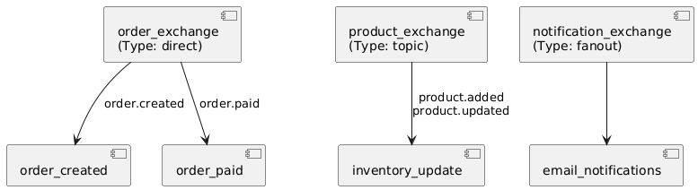

# Gorten

Gorten is a project for education purposes developed for me in Golang, designed to implement a checkout service for an e-commerce marketplace platform. This project aims to provide a practical learning experience by covering essential components of an e-commerce system, including:

- **Infrastructure Setup**: Implementing RabbitMQ for messaging, Kubernetes and MongoDB for data storage.
- **Core Resources**: Developing several resources such as User, Company, Category, Product, Order, Payment, and Shopping Cart.
- **Checkout Process**: Handling the finalization of purchases.
- **API Enhancements**: Focusing on security, resilience, and scalability improvements.
- **Monitoring and Documentation**: Implementing tracing, monitoring and documenting the API with OpenAPI specification (Swagger).
- **Future features**: Planning for additional features and improvements.

The Gorten project aims to demonstrate practical applications of Golang in building robust and scalable e-commerce solutions while offering hands-on experience with modern software practices and technologies.

## Architecture

### RabbitMQ

## Roadmap

The project will be divided into the following phases:

1. API Gateway Installation **(done)**
2. RabbitMQ Installation **(done)**
3. MongoDB Installation
4. User resource
5. Company resource
6. Category resource
7. Products resource
8. Orders and Orders Items resource
9. Payments resource
10. Shopping Cart resource
11. Checkout resource
12. Enhance API Security
13. Kubernetes Installation
14. Enhance API Resilience
15. Enhance API Scalability
16. Monitoring & Tracing
17. The Open API Documentation
18. Future features

# 1. API Gateway Installation

## Features

| Package                                                                  | Description                                                                                                                                                                                    |
| ------------------------------------------------------------------------ | ---------------------------------------------------------------------------------------------------------------------------------------------------------------------------------------------- |
| Setup API Gateway using [Kong](https://konghq.com/products/kong-gateway) |                                                                                                                                                                                                |
| Authentication using JWT Kong Plugin                                     | All APIs will only be accessed by a JWT token                                                                                                                                                  |
| Fall-safe using request-termination Kong Plugin                          | Implements rejection of unauthorized requests to implement a security policy that rejects any request not associated with a defined route. This is done by checking if the route is configured |
| The Response Transformer plugin                                          | Add HTTP Headers to avoid XSS and Clickjacking attacks                                                                                                                                         |
| Docker                                                                   |                                                                                                                                                                                                |

# 2. RabbitMQ Installation

To set up RabbitMQ for this project, we've provided an automated shell script that configures the necessary exchanges, queues, and bindings. Follow the instructions below to get RabbitMQ up and running.

**Running the Setup Script**
The setup script (setup-rabbitmq.sh) is designed to be executed automatically when the RabbitMQ container starts. This script performs the following actions:

- Waits for RabbitMQ to Start: The script waits until RabbitMQ's management API is available before proceeding with configuration.
- Creates an Admin User: A dedicated RabbitMQ admin user (rabbitmq_admin) is created with the specified password.
- Configures Exchanges, Queues, and Bindings: The script declares all necessary exchanges, queues, and bindings as required by the application.

**Environment Variables**
You can customize the RabbitMQ setup using environment variables:

RABBITMQ_USER: Username for the RabbitMQ admin user (default: rabbitmq_admin).

RABBITMQ_PASSWORD: Password for the RabbitMQ admin user (default: my_password).

RABBITMQ_HOST: Hostname for RabbitMQ (default: localhost).

RABBITMQ_PORT: Management API port (default: 15672).

WAIT_TIME: (default:10)

To override these defaults, you can set the environment variables in your .env file.

# 3. MongoDB Installation

TBD

# 4. User resource

TBD

# 5. Company resource

TBD

# 6. Category resource

TBD

# 7. Products resource

TBD

# 8. Orders and Orders Items resource

TBD

# 9. Payments resource

TBD

# 10. Shopping Cart resource

TBD

# 11. Checkout resource

TBD

# 12. Enhance API Security

TBD

# 13. Kubernetes Installation

TBD

# 14. Enhance API Resilience

In this phase, I will implement some strategies to improve the resilience of APIs, ensuring they can handle with failures and recover effectively. I will adopting the following strategies and tools:

- Implement Circuit Breaker using Circuit Breaker package in Kong API Gateway.
- Implement Circuit Breaker using Hystrix-Go package.
- Implement retries e backoff using Retry-Go package.
- Configure timeout into the entire services in Kong API Gateway
- Implement Fallback Pattern using Go-Fallback or Resilience4j package (I’m not sure yet).
- Implement Bulkheads.
- Implement Active Health Checks in Kong API Gateway
- Implement Failover strategies with Kubernetes (replicaSet)

# 15. Enhance API Scalability

To ensure API Scalability and can handle increasing demand effectively, I will adopting the following strategies and tools:

- Implement Load Balancing with Kubernetes
- Implement Caching with Redis
- Implement Rate Limiting Using the Kong Plugin

# 16. Monitoring & Tracing

This phase I will integrating monitoring through the entire system to ensure visibility and performance management. The goal is to provide real-time insights, track system health, and identify potential issues early by monitoring various metrics, logs, and events across all services. This will help in maintaining system reliability and performance.

- Implement monitoring across all services (I haven´t chosen the application yet)
- Implement Distributed Tracing with Jaeger

# 17. The Open API Documentation

In this phase, the OpenAPI documentation will be created for every API within the project. This documentation will serve as a detailed reference with all available endpoints, request and response formats, and authentication methods by using the OpenAPI specifications.

- Provide The OpenAPI Documentation with Swagger for All APIs

# 18. Future features

| Feature / Application | Description                   |
| --------------------- | ----------------------------- |
| Kubernetes            | Implements Service Register   |
| Jenkins               | Implements CI/CD with Jenkins |
